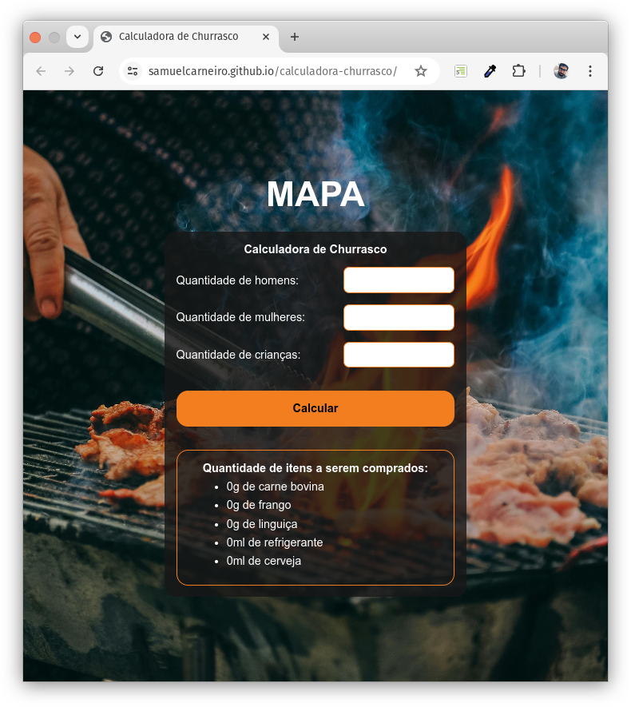

# calculadora-churrasco
Atividade MAPA da disciplina Programação Front-end (522024) do curso de Analíse e Desenvolvimento de Sistemas - UniCesumar (EAD).
Desenvolver uma página Web com uma calculadora de churrasco onde será calculado os "ingredientes" de acordo com a quantidade de participantes.
Utilizando HTML5, CSS3 e Javascript.

[Clique aqui para acessar a Calculadora](https://samuelcarneiro.github.io/site-allan-ramalho-consultoria/)

### Consumo considerado nos cálculos
|              | Homens | Mulheres | Crianças |
| ------------ | ------ | -------- | -------- |
| Carne Bovina | 500g   | 300g     | 200g     |
| Frango       | 200g   | 200g     | 100g     |
| Linguiça     | 200g   | 200g     | 200g     |
| Refrigerante | 300ml  | 400ml    | 200ml    |
| Cerveja      | 800ml  | 500ml    | 0        |

### Tecnologias utilizadas

